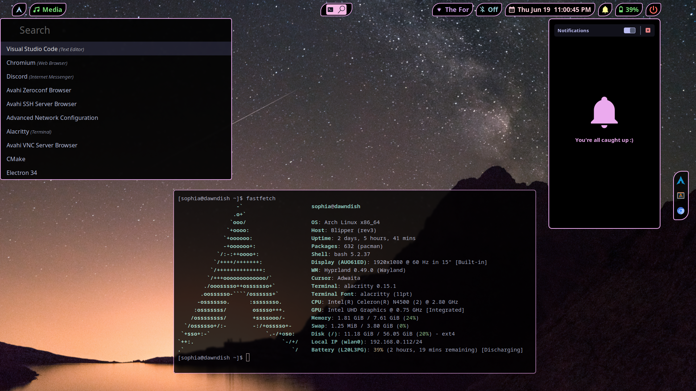

# soap-phia's Arch Rice | made for riceathon v2 (more specifically the blahaj)



**Uses:**
- hyprland
- hyprpanel
- nwg-dock-hyprland
- rofi

ricing on a chromebook was a wonderful idea

# Use the rice (simple)
```bash
git clone https://github.com/soap-phia/arch-rice/
cd arch-rice
cp -r config/* ~/.config/
cp -r local/* ~/.local/
```
